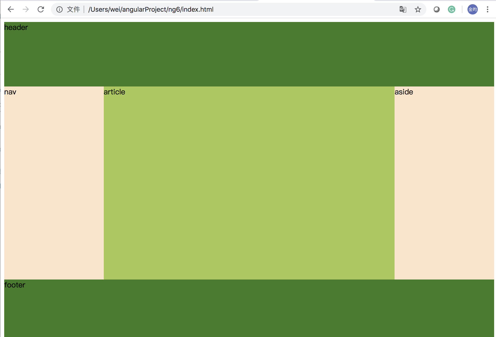
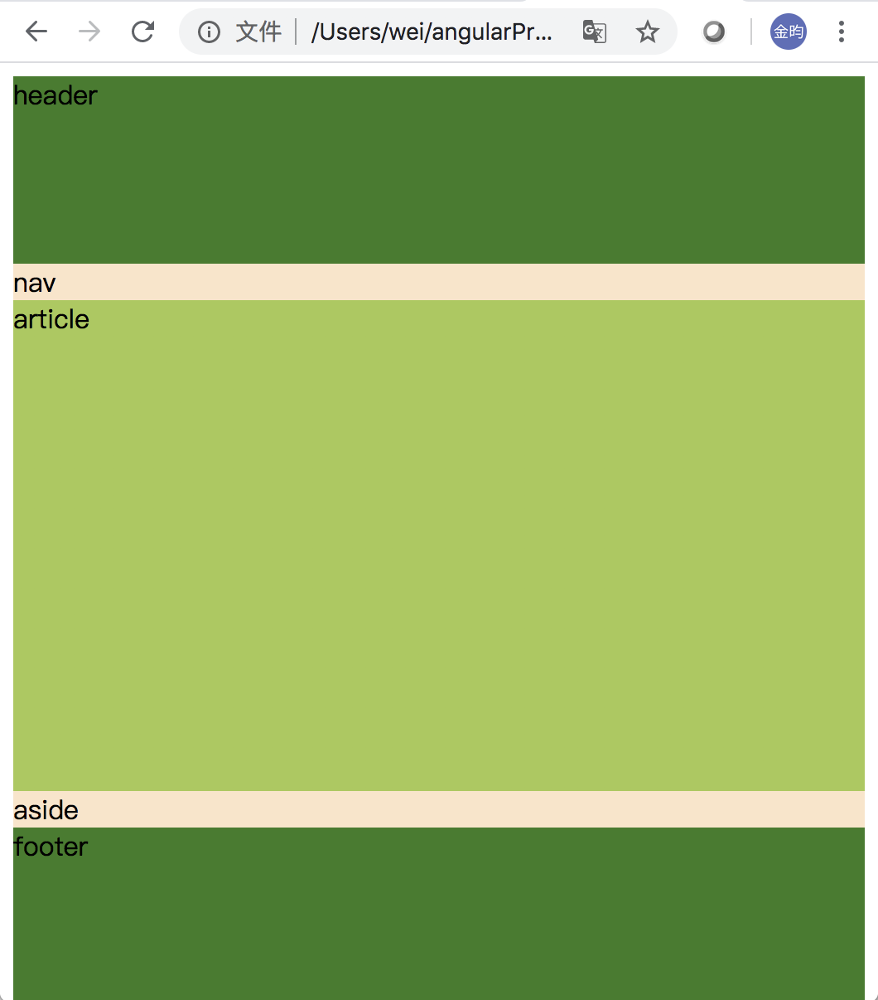
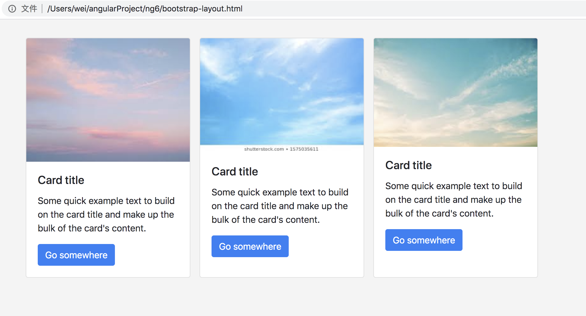
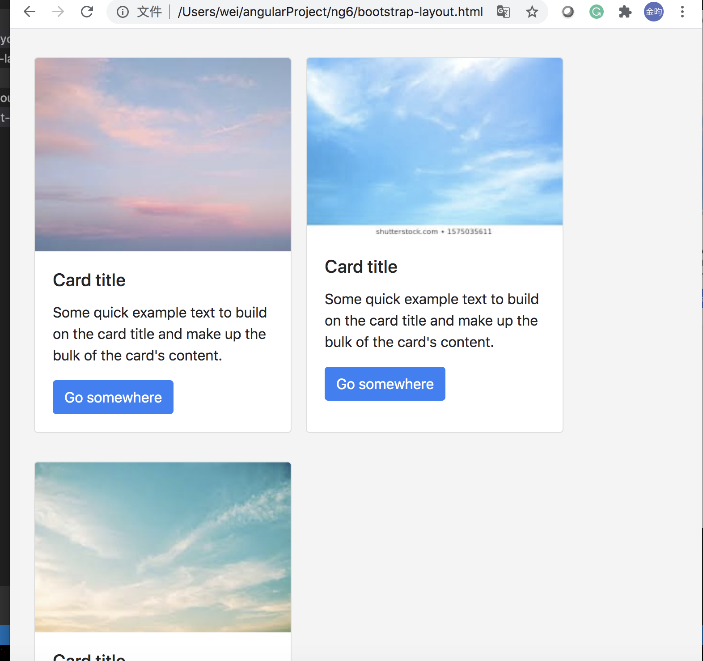

# Layout

## flex box layout based on media query



When the width is less than 576px, this page will change to the style "mobile first"




key point: 

```css
@media screen and (min-width: 576px){
    .main{
    	flex-direction: row;
    }
    .main .nav, .main .aside{
    	flex: 0 0 20vw;
    }
}
```


## Bootsrap layout




[Bootstap](https://getbootstrap.com/docs/4.5/getting-started/introduction/) is a mobile-first and reponsive front-end framwork. 

We can see in the following picture that the page style is automatically adjusted when we change the size of page.


